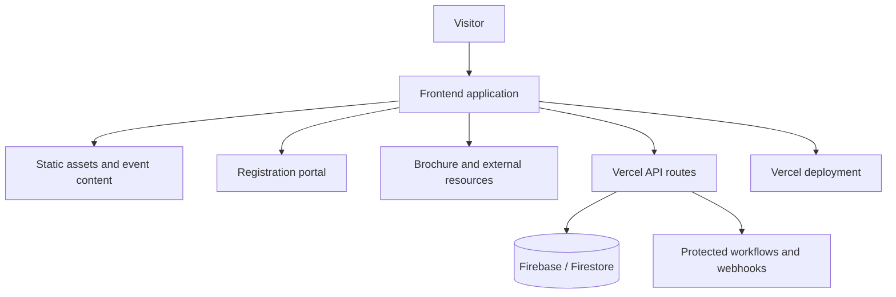

<div align="center">

# ✦ INSPIRE COLLOQUIUM ✦

### Official Event Website & Digital Experience

**Inspiring Ideas · Enabling Innovation · Impacting Tomorrow**

[](https://inspire-colloquium.vercel.app/)
[](https://inspire-colloquium.vercel.app/)
[](https://inspire-colloquium.vercel.app/)
[](https://inspire-colloquium.vercel.app/)

**IEEE SLRTCE Student Branch**  
**Department of Computer Engineering**  
**Shree L. R. Tiwari College of Engineering**

</div>

---

## About This Repository

This private repository contains the production website for **INSPIRE Colloquium**, a national research and idea colloquium organised by the IEEE SLRTCE Student Branch and the Department of Computer Engineering, Shree L. R. Tiwari College of Engineering.

The website is the public entry point for the event. It explains the event, eligibility, research tracks, UN Sustainable Development Goal alignment, schedule, awards, registration process, frequently asked questions and official contact information.

> **Live production website:** [inspire-colloquium.vercel.app](https://inspire-colloquium.vercel.app/)

This README is also the internal handover guide for future organising and development teams. Update it whenever the architecture, deployment process, integrations or event workflow changes.

---

## Event at a Glance

| Item | Details |
|---|---|
| **Event** | INSPIRE Colloquium — A Research & Idea Colloquium |
| **Theme** | Research, innovation, interdisciplinary exploration and societal impact |
| **Organised by** | IEEE SLRTCE Student Branch |
| **Academic host** | Department of Computer Engineering, SLRTCE |
| **Venue** | Shree L. R. Tiwari College of Engineering, Mira Road, Maharashtra |
| **Categories** | UG/Diploma teams, PG individuals and PPG/PhD researchers |
| **Research tracks** | 9 multidisciplinary, UNSDG-aligned tracks |
| **Event date shown on production** | 17 October 2026 |
| **Official email** | [colloquium.ieee@slrtce.in](mailto:colloquium.ieee@slrtce.in) |

---

## Website Experience

The deployed website currently includes:

- Animated loading and landing experience
- Responsive sticky navigation with section links
- Hero section with registration, brochure, date and venue actions
- Institutional profiles for SLRTCE, the Department of Computer Engineering and IEEE SLRTCE
- Event purpose, vision, presentation scope and evaluation criteria
- Eligibility cards for UG/Diploma, PG and PPG/PhD participants
- Nine interactive research-track cards mapped to relevant UNSDGs
- Multi-stage event schedule from submission to the grand finale
- Prize pool and category-wise award information
- Filterable FAQ section
- Official registration and brochure links
- Contact, address and social-media information
- Responsive layouts for desktop and mobile visitors

### Research Tracks

| 01–03: Core & Health | 04–06: Sustainable Systems | 07–09: Frontier Technologies |
|---|---|---|
| Artificial Intelligence & Machine Learning | Sustainability | Financial Technology |
| Internet of Things | Cybersecurity | Blockchain |
| Healthcare & MedTech | Automation | Emerging Technologies |

---

## Application Architecture



### Repository Structure

```text
.
├── api/                  # Vercel serverless endpoints and protected integrations
├── public/               # Static files, logos, images and public assets
├── src/                  # Main frontend source code
├── tests/                # Automated checks
├── .env.example          # Safe environment-variable template
├── .gitignore            # Files that must never be committed
├── PPT Submission.json   # Submission/workflow configuration used by the project
├── package.json          # Dependencies and npm scripts
└── README.md             # Project and handover documentation
```

> Folder contents may evolve. Treat the current source tree and `package.json` as the final authority when this document and the code differ.

---

## Local Development

### Requirements

- Node.js **LTS**
- npm
- Git
- Access to the project’s approved Firebase/Firestore and Vercel resources when working on connected features

### 1. Clone the private repository

```bash
git clone https://github.com/ieee-colloquium/inspire-colloquium-ieee-slrtce-2026-vercel.git
cd inspire-colloquium-ieee-slrtce-2026-vercel
```

### 2. Install dependencies

```bash
npm install
```

For a clean, reproducible CI-style installation when the lockfile is current:

```bash
npm ci
```

### 3. Create the local environment file

```bash
cp .env.example .env.local
```

On Windows PowerShell:

```powershell
Copy-Item .env.example .env.local
```

Fill only the values supplied by an authorised project owner. Never copy credentials from screenshots, chat messages or old deployment logs.

### 4. Start the development server

```bash
npm run dev
```

Open the local URL printed in the terminal. Vite commonly uses `http://localhost:5173`, but the terminal output is authoritative.

### 5. Create a production build

```bash
npm run build
```

### 6. Preview the production build

```bash
npm run preview
```

### 7. Run quality checks

Use the scripts currently defined in `package.json`. Where available, run:

```bash
npm run lint
npm run test
npm run build
```

Do not deploy if linting, tests or the production build fail.

---

## Environment Variables & Security

The checked-in **`.env.example` is the only approved reference for variable names**. Keep it updated with placeholder values whenever a new configuration key is introduced.

| Configuration type | Where it belongs | Rule |
|---|---|---|
| Public frontend configuration | Client-safe `VITE_*` variables | Assume every value is visible to visitors |
| Firebase web-app configuration | Client variables listed in `.env.example` | Protect data through Firestore rules, not secrecy of client config |
| Database/admin credentials | Server environment only | Never expose through `VITE_*` variables |
| Webhook tokens and signing secrets | Vercel server environment only | Validate on every protected API request |
| External workflow URLs | Use the scope specified in `.env.example` | Do not hard-code private endpoints in source files |

### Never commit

- `.env`
- `.env.local`
- Service-account JSON files
- Firebase Admin private keys
- Webhook secrets or bearer tokens
- Personal access tokens
- Production database exports containing participant information
- Payment receipts or participant documents

If a secret is accidentally committed, deleting it from the latest file is **not enough**. Revoke or rotate the secret immediately and review the Git history.

---

## Firebase / Firestore Responsibilities

The application and connected submission workflows use Firebase/Firestore-related configuration. Future maintainers must verify all of the following before production use:

- The production project ID is correct.
- Firestore security rules deny unauthorised reads and writes.
- Participant records are not publicly queryable.
- Only required fields are collected.
- Admin/server credentials remain server-side.
- Test data is separated from production data.
- Retention and deletion decisions are approved by the organising committee.
- Backups or exports are stored only in authorised locations.

Do not weaken Firestore rules merely to fix a frontend permission error. Diagnose the authentication and data-flow requirement first.

---

## Content Update Map

Before editing, search the `src/` and `public/` folders for the currently displayed text or asset name.

| Requirement | What to review |
|---|---|
| Event name, tagline and hero copy | Landing/hero components |
| Event date and countdown | Hero and schedule data; verify both use the same source |
| Registration deadline | Navigation countdown and schedule milestone |
| Registration URL | All Register buttons and environment/config values |
| Brochure | Both brochure links and the hosted document’s access settings |
| Eligibility | UG/Diploma, PG and PPG/PhD cards plus FAQ answers |
| Tracks and UNSDGs | Track data, cards, images and accessible labels |
| Schedule | Every stage, date, time, venue and selection count |
| Awards | Prize pool, category wording and award descriptions |
| Contact details | Contact section, email links, address and social links |
| Logos and media | Assets in `public/` and their alt text |
| SEO/share preview | Page title, description, keywords and Open Graph metadata |

After any event-data change, search the whole repository for the old value. This prevents an outdated date or event name from remaining in a second component.

---

## Deployment on Vercel

The production website is deployed at:

**https://inspire-colloquium.vercel.app/**

### Normal deployment flow

1. Create a short-lived feature branch.
2. Make and locally verify the change.
3. Run linting, tests and a production build.
4. Push the branch and review the Vercel preview deployment.
5. Test navigation, forms, external links and mobile layouts.
6. Merge only after approval from an authorised maintainer.
7. Verify the production deployment after merging.

### Vercel project settings to preserve

- Correct Git repository and production branch
- Framework/build settings used by the current deployment
- Production and preview environment variables
- Serverless API route configuration
- Approved custom domains, if introduced later
- Access limited to current authorised maintainers

Never paste production secrets into source code to “make deployment work.” Add them through the Vercel project’s environment-variable settings.

---

## Pre-Deployment Checklist

### Content

- [ ] Event name, dates, deadlines and venue are approved.
- [ ] Registration and brochure links open correctly.
- [ ] Eligibility, selection counts and fees match official communication.
- [ ] Schedule information is consistent across all sections.
- [ ] Contact email and social links are current.

### Engineering

- [ ] Dependencies install successfully from a clean checkout.
- [ ] Linting and automated tests pass.
- [ ] Production build completes without errors.
- [ ] Browser console has no unexpected errors.
- [ ] All internal navigation links reach the correct section.
- [ ] External links use the intended official destinations.
- [ ] Layout has been tested on desktop, tablet and mobile.
- [ ] Images have useful alternative text.

### Security & Privacy

- [ ] No secret appears in Git changes, browser code or build output.
- [ ] Protected API routes reject missing or invalid authentication/tokens.
- [ ] Firestore rules have been reviewed for the release.
- [ ] Participant information is not exposed in logs or client responses.
- [ ] Payment and submission integrations use approved production endpoints.

### Production Verification

- [ ] Vercel reports a successful deployment.
- [ ] The live homepage loads without a blank screen.
- [ ] Registration, brochure, venue, email and social links work.
- [ ] Countdown and schedule show the correct dates.
- [ ] A committee member has completed a final visual review.

---

## Git Workflow

Use meaningful branches and commits so future teams can understand the history.

### Suggested branches

```text
feature/update-schedule
fix/mobile-navigation
content/update-faq
security/harden-webhook
```

### Suggested commits

```text
feat(schedule): update event milestones
fix(registration): correct registration portal link
content(faq): clarify participant eligibility
security(api): validate webhook token server-side
docs(readme): update deployment handover
```

Avoid unrelated changes in the same commit. Never commit directly to production when a preview review is possible.

---

## Annual Handover Procedure

The outgoing team must complete this checklist with the incoming team:

- [ ] Add at least two current maintainers to the private repository.
- [ ] Transfer or confirm Vercel project access.
- [ ] Transfer or confirm Firebase project access.
- [ ] Confirm ownership of the official email and social accounts.
- [ ] Review environment-variable names without sharing secrets in Git.
- [ ] Rotate sensitive credentials when committee membership changes.
- [ ] Explain the registration, submission, payment and evaluation integrations.
- [ ] Archive outdated participant data according to the approved policy.
- [ ] Remove access for members who no longer require it.
- [ ] Perform a clean local setup using only this README and `.env.example`.
- [ ] Record known issues and unfinished work in GitHub Issues.
- [ ] Update this README with the new event cycle and maintainers.

> The handover is complete only when the incoming team can install, configure, test and deploy the project without using an outgoing member’s personal account.

---

## Troubleshooting

| Problem | First checks |
|---|---|
| Blank page after deployment | Inspect browser console, Vercel logs, asset paths and required client variables |
| API route fails | Check server logs, environment scope, request method and token verification |
| Firestore permission denied | Review authentication state and security rules; do not make the database public |
| Images do not load | Verify filename casing and asset location under `public/` |
| Old date still appears | Search the complete repository for the old date and check countdown configuration |
| Registration button opens wrong page | Search for every registration URL and centralise it in configuration |
| Preview works but production fails | Compare preview/production environment variables and Vercel settings |

---

## Maintainer Notes

- Keep this repository **private** because it contains operational implementation details.
- Use GitHub Issues for bugs, enhancements and handover tasks.
- Document architecture decisions that would surprise a future maintainer.
- Never upload real participant data as test fixtures.
- Prefer configuration-driven event content over repeating values across components.
- Preserve accessibility, responsive behaviour and performance while editing visual sections.

---

## Official Links

| Resource | Link |
|---|---|
| Live website | [inspire-colloquium.vercel.app](https://inspire-colloquium.vercel.app/) |
| Registration portal | [Open registration](https://inspire-colloquium-registration-page.vercel.app/) |
| Venue | [Shree L. R. Tiwari College of Engineering](https://www.google.com/maps/search/Shree+L.R.+Tiwari+College+of+Engineering) |
| Participant support | [colloquium.ieee@slrtce.in](mailto:colloquium.ieee@slrtce.in) |

---

<div align="center">

### INSPIRE COLLOQUIUM

**Research · Innovation · Exploration · Impact**

Built and maintained with purpose by the **IEEE SLRTCE Student Branch**  
and the **Department of Computer Engineering, SLRTCE**.

</div>
